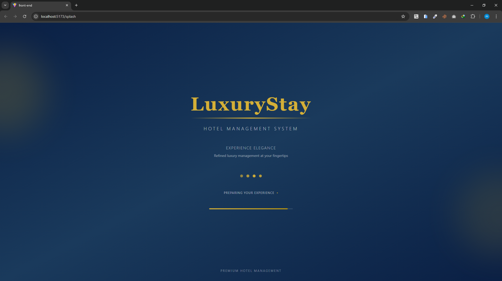
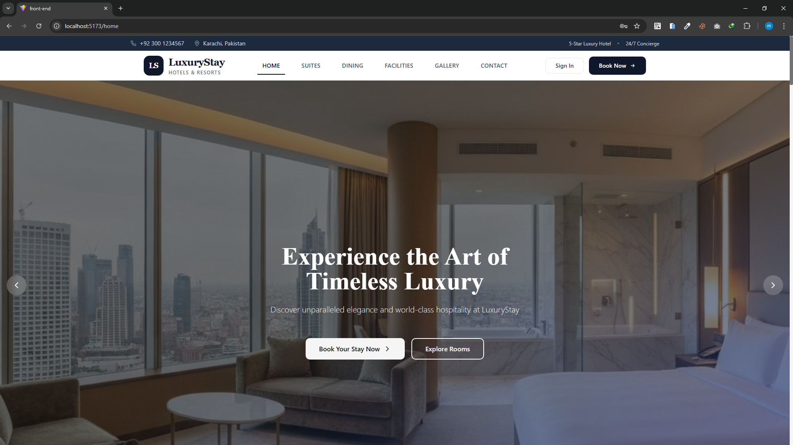
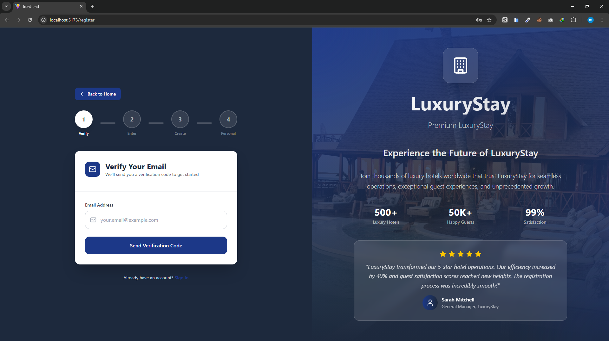
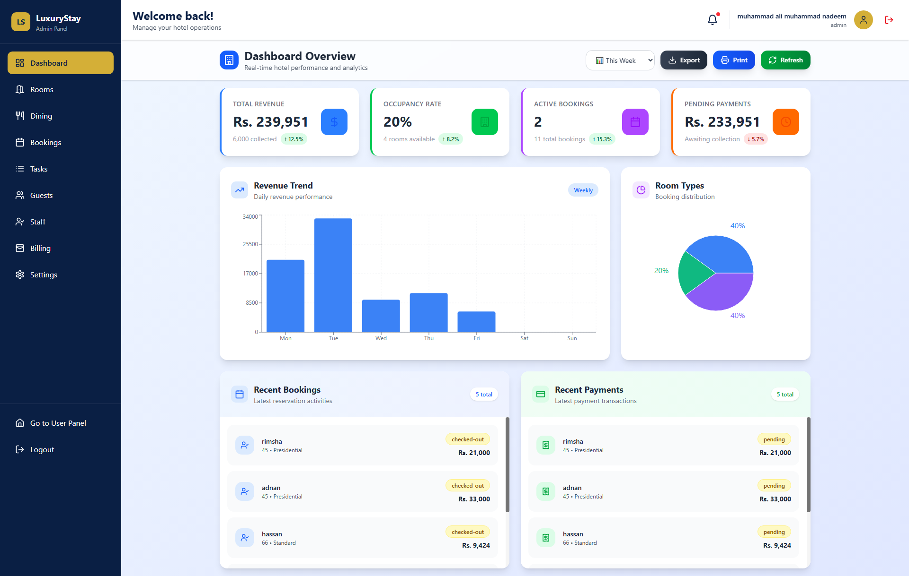
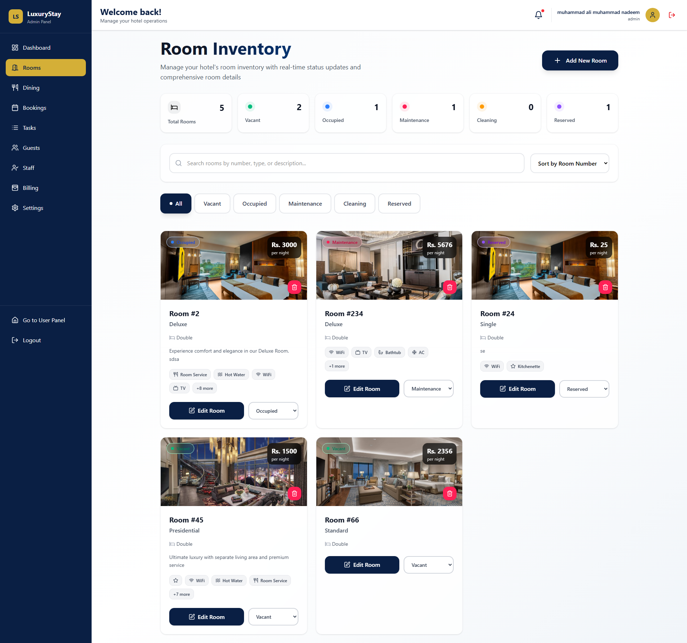
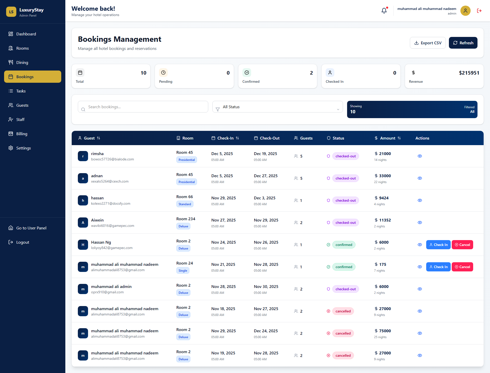

# LuxuryStay  -- Hotel Management System (HMS)

## Overview

🏨 LuxuryStay  – Hotel Management System (HMS)

📌 Overview

LuxuryStay  is a premium hotel chain recognized for 
exceptional service and luxurious accommodations.
To modernize its operations, the Hotel Management 
System (HMS) has been designed to streamline workflows, enhance staff efficiency, 
improve guest experiences, and enable data-driven decision-making.

This system provides real-time communication, 
secure user authentication, smooth reservation handling, 
and complete hotel operations management.

------------------------------------------------------------------------

# 📸 Project Screenshots & Video

[Watch Demo Video](Video/video.mp4)

    

------------------------------------------------------------------------

## Key Features

### 👥 User & Role Management

- Admin dashboard for system-wide control

- Role-based access: Manager, Receptionist, Housekeeping, Maintenance

- Add, edit, deactivate staff accounts

- Guest profile creation, including personal info & preferences

### 🏨 Room Management

- Complete room inventory with pricing, types, images, and details
- Real-time availability updates
- Live room status (Clean, Occupied, Maintenance, Available) using Socket.io
- Room assignment & management by staff

### 📅 Reservation & Check-In/Out

- Online and staff-assisted bookings
- Automatic room allocation
- Digital key issuance support
- Automatic room status updates
- Smooth checkout flow with billing included

### 💵 Billing & Invoicing

- Auto-generated invoices
- Additional charges included (food, laundry, transport, etc.)
- PDF/printable invoice support
- Email-friendly invoice structure

### 🧹 Housekeeping & Maintenance

- Housekeeping dashboard with assigned rooms
- Mark cleaning tasks as completed
- Maintenance issue reporting (guest + staff)
- Real-time updates using Socket.io

### 📊 Reporting & Analytics

- Occupancy rate reports
- Revenue statistics
- Guest feedback reports
- Analytics for demand forecasting & pricing optimization

### 🔐 Security & Authentication

- JWT-based authentication
- Encrypted passwords using Bcrypt
- Role-based access control
- Protects sensitive user data
- Follows modern security best practices

### 💬 Feedback & Guest Services

- Guest feedback & rating system
- Service requests:
-  - Room service
-  -Wake-up calls
-  -Transportation support

### ⚙️ System Administration

- Configure room rates
- Manage taxes & policies
- System-wide settings
- Staff notifications for bookings, maintenance, and tasks

## Non-Functional Requirements

- Fast performance (1--2s)
- Supports 100s of concurrent users
- Data privacy & security
- Regular data backup
- Mobile responsive UI
- Accessibility (WCAG)

## 📦  Technologies Used

---

| Technology                     | Purpose                                   |
| ------------------------------ | ----------------------------------------- |
| **Node.js / Express.js**       | Backend server & API                      |
| **MongoDB**                    | NoSQL database for dynamic data           |
| **EJS**                        | Server-side template rendering            |
| **Socket.io**                  | Real-time updates (tasks, status, alerts) |
| **JWT / Bcrypt**               | Authentication & secure password hashing  |
| **CSS / Bootstrap / Tailwind** | Frontend styling                          |
| **Framer Motion**              | Smooth interactive animations             |
| **GSAP**                       | Advanced UI animations & transitions      |

---

## Installation

    git clone LuxuryStay-E-project
    npm install 
        

### Environment Variables

    PORT = 3000
    MONGO_URI=your_mongo_connection_string
    JWT_SECRET=your_secret_key

### Run the Project

    npm run dev

## Real-Time Example (socket.io)

    io.on("connection", (socket) => {
      socket.on("taskAssigned", (data) => {
        io.emit("taskUpdate", data);
      });
    });

## Project Structure

LuxuryStay-HMS/
│
├── frontend/
│   ├── public/
│   │   ├── favicon.ico
│   │   ├── index.html
│   │   ├── images/               # UI images and icons
│   │   │   ├── logos/
│   │   │   ├── room-types/
│   │   │   ├── staff/
│   │   │   └── amenities/
│   │   └── videos/               # Demo videos
│   │
│   ├── src/
│   │   ├── assets/
│   │   │   ├── fonts/
│   │   │   ├── styles/
│   │   │   │   ├── globals.css
│   │   │   │   ├── variables.css
│   │   │   │   └── components/
│   │   │   └── icons/
│   │   │
│   │   ├── components/
│   │   │   ├── common/
│   │   │   │   ├── Button/
│   │   │   │   ├── Modal/
│   │   │   │   ├── Table/
│   │   │   │   └── Form/
│   │   │   ├── layout/
│   │   │   │   ├── Header/
│   │   │   │   ├── Sidebar/
│   │   │   │   ├── Footer/
│   │   │   │   └── DashboardLayout/
│   │   │   └── ui/
│   │   │       ├── Cards/
│   │   │       ├── Charts/
│   │   │       └── Loaders/
│   │   │
│   │   ├── pages/
│   │   │   ├── auth/
│   │   │   │   ├── Login/
│   │   │   │   ├── Register/
│   │   │   │   └── ForgotPassword/
│   │   │   ├── dashboard/
│   │   │   ├── rooms/
│   │   │   ├── bookings/
│   │   │   ├── staff/
│   │   │   ├── housekeeping/
│   │   │   └── analytics/
│   │   │
│   │   ├── services/
│   │   │   ├── api.js
│   │   │   ├── authService.js
│   │   │   ├── roomService.js
│   │   │   └── bookingService.js
│   │   │
│   │   ├── utils/
│   │   │   ├── helpers.js
│   │   │   ├── validators.js
│   │   │   └── constants.js
│   │   │
│   │   ├── hooks/
│   │   │   ├── useAuth.js
│   │   │   ├── useFetch.js
│   │   │   └── useSocket.js
│   │   │
│   │   ├── contexts/
│   │   │   ├── AuthContext.js
│   │   │   ├── ThemeContext.js
│   │   │   └── SocketContext.js
│   │   │
│   │   ├── App.jsx
│   │   ├── main.jsx
│   │   ├── routes.jsx
│   │   └── store.js          # Redux or Zustand store
│   │
│   ├── .env.local
│   ├── package.json
│   ├── vite.config.js        # or webpack.config.js
│   └── README.md
│
├── backend/
│   ├── config/
│   │   ├── database.js       # MongoDB connection
│   │   ├── socket.js         # Socket.io setup
│   │   ├── env.js            # Environment config
│   │   └── multer.js         # File upload config
│   │
│   ├── controllers/
│   │   ├── authController.js
│   │   ├── roomController.js
│   │   ├── bookingController.js
│   │   ├── staffController.js
│   │   ├── housekeepingController.js
│   │   └── analyticsController.js
│   │
│   ├── models/
│   │   ├── User.js
│   │   ├── Room.js
│   │   ├── Booking.js
│   │   ├── Task.js
│   │   ├── Feedback.js
│   │   └── Inventory.js
│   │
│   ├── routes/
│   │   ├── authRoutes.js
│   │   ├── roomRoutes.js
│   │   ├── bookingRoutes.js
│   │   ├── staffRoutes.js
│   │   ├── housekeepingRoutes.js
│   │   ├── analyticsRoutes.js
│   │   └── uploadRoutes.js
│   │
│   ├── middleware/
│   │   ├── auth.js
│   │   ├── role.js
│   │   ├── validation.js
│   │   ├── upload.js
│   │   └── errorHandler.js
│   │
│   ├── sockets/
│   │   ├── taskSocket.js
│   │   ├── roomStatusSocket.js
│   │   └── housekeepingSocket.js
│   │
│   ├── utils/
│   │   ├── jwt.js
│   │   ├── email.js
│   │   ├── logger.js
│   │   ├── generatePDF.js
│   │   └── validators.js
│   │
│   ├── services/
│   │   ├── bookingService.js
│   │   ├── roomService.js
│   │   ├── staffService.js
│   │   ├── notificationService.js
│   │   └── reportService.js
│   │
│   ├── app.js
│   ├── server.js
│   ├── .env
│   ├── package.json
│   └── README.md
│
├── docs/
│   ├── api/
│   │   ├── auth-api.md
│   │   ├── room-api.md
│   │   └── booking-api.md
│   ├── database/
│   │   ├── schema.md
│   │   └── relations.md
│   ├── setup/
│   │   ├── installation.md
│   │   └── deployment.md
│   └── architecture.md
│
├── tests/
│   ├── frontend/
│   │   ├── unit/
│   │   ├── integration/
│   │   └── e2e/
│   ├── backend/
│   │   ├── unit/
│   │   ├── integration/
│   │   └── api/
│   └── fixtures/             # Test data
│
├── scripts/
│   ├── deploy.sh
│   ├── backup.sh
│   └── seed-database.js
│
├── docker/
│   ├── frontend.Dockerfile
│   ├── backend.Dockerfile
│   ├── docker-compose.yml
│   └── nginx.conf
│
├── .github/
│   └── workflows/           # CI/CD pipelines
│
├── .gitignore
├── package.json            # Root package.json (if monorepo)
├── README.md
├── LICENSE
└── .env.example

## Author

Muhammad Ali -- Full Stack Developer
Technologies: Node.js, Express, MongoDB, EJS, GSAP, socket.io
